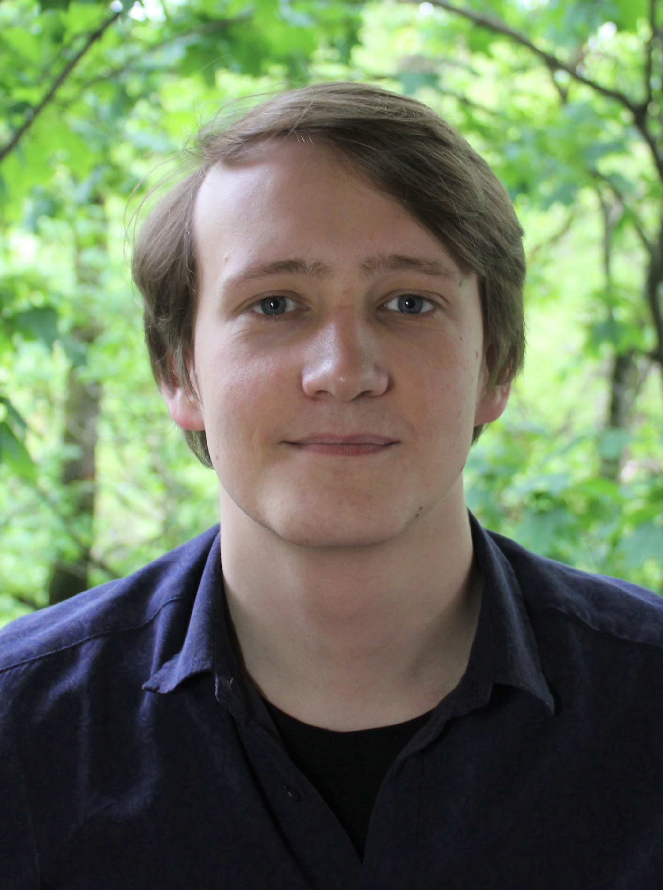

# Dmitry Bikmetov

## CONTACTS

### Contacts1

**e-mail:**<bikdm12@gmail.com>

**ResearchGate:**[link](https://www.researchgate.net/profile/Dmitry_Bikmetov "ReasearchGate: Dmitry Bikmetov")

**GitHub:**[bikdm12](https://github.com/bikdm12 "Github: Dmitry Bikmetov")

### Contacts2

**address:**41-1 Ostrovityanova St. Apt. 230,

117342, Moscow, Russia

**phone:**+7 (965) 297-58-24

## EDUCATION

### 2012 - 2018

#### Specialist in bioengineering and bioinformatics (equivalent to M.Sc.)

Faculty of Bioengineering and Bioinformatics

Lomonosov Moscow State University, Moscow, Russia

### 2010 - 2012

#### High school

Advanced Educational Scientific Center – Kolmogorov’s boarding school

Lomonosov Moscow State University, Moscow, Russia

## RESEARCH EXPERIENCE

### 2018 - present

#### Junior research fellow  

Center for Precision Genome Editing and Genetic Technologies for Biomedicine, Institute of
Gene Biology, Moscow, Russia

Skolkovo Institute of Science and Technology, Moscow, Russia

Research group of prof. Konstantin Severinov

Characterization of novel bacterial toxin-antitoxin systems.
Mining of bacterial genomes for new natural products with antibiotic activity

Supervisor: Prof. Konstantin Severinov

### 2015 - 2018

#### Specialist's thesis

A.N. Belozersky Institute of Physico-Chemical Biology, Moscow, Russia

Laboratory of Protein Synthesis Regulation

Role of proteins interacting with DAP5 (eIF4G2) mRNA in translation regulation

Supervisor: Dr. Ilya Terenin

### 2014 - 2015

#### Undergraduate research project

Engelhardt Institute of Molecular Biology, Moscow, Russia.

Laboratory of Cell Proliferation

Influence of mTOR inhibitor torin-2 on cell growth and p73 protein level

Supervisors: Alexandra Dalina, Prof. Peter Chumakov

### 2013 - 2014

#### Undergraduate research project

A.N. Belozersky Institute of Physico-Chemical Biology, Moscow, Russia.

Laboratory of Membrane Biophysics
Properties of SkQ hydrophobic cations as a transmembrane electron carrier

Supervisors: Dr. Tatyana Rokitskaya, Dr. Yuri Antonenko

## PUBLICATIONS

1. Ovchinnikov, S. V,**Bikmetov, D.,**Livenskyi, A., Serebryakova, M., Wilcox, B., Mangano, K., … Dubiley, S. (2020). Mechanism of translation inhibition by type II GNAT toxin AtaT2. *Nucleic Acids Research, 48(15), 8617–8625.* <https://doi.org/10.1093/nar/gkaa551>
2. Travin, D. Y.,**Bikmetov, D.,**& Severinov, K. (2020). Translation-Targeting RiPPs and Where to Find Them. *Frontiers in Genetics, 11, 226.* <https://doi.org/10.3389/fgene.2020.00226>
3. Zukher, I., Pavlov, M., Tsibulskaya, D., Kulikovsky, A., Zyubko, T.,**Bikmetov, D.,**… Severinov, K. (2019). Reiterative Synthesis by the Ribosome and Recognition of the N-Terminal Formyl Group  by Biosynthetic Machinery Contribute to Evolutionary Conservation of the Length of Antibiotic Microcin C Peptide Precursor. *MBio, 10(2).* <https://doi.org/10.1128/mBio.00768-19>
4. Smirnova, V. V, Shestakova, E. D.,**Bikmetov, D. V,**Chugunova, A. A., Osterman, I. A., Serebryakova, M. V, … Terenin, I. M. (2019). eIF4G2 balances its own mRNA translation via a PCBP2-based feedback loop. *RNA (New York, N.Y.), 25(7), 757–767.* <https://doi.org/10.1261/rna.065623.118>

## CONFERENCES

### April, 2015
XII Student Conference, Faculty of Bioengineering and Bioinformatics,
Lomonosov Moscow State University, Moscow, Russia

**Poster presentation:**"mTOR inhibitor Torin2 affects p73 level and cell growth"

### April, 2014
XI Student Conference, Faculty of Bioengineering and Bioinformatics,
Lomonosov Moscow State University, Moscow, Russia

**Poster presentation:**"Redox reactions coupled to diffusion of SkQ hydrophobic cations across lipid membrane"

## AWARDS

### 2019

Russian National Student Olympiad «I am a professional» awardee

### 2016

Travel grant for the summer school at the Osnabrueck University, Germany.
Granted by the Faculty of Bioengineering and Bioinformatics for top 4 fourth year students

### 2009, 2010, 2011

Russian National School Olympiad in Biology 4th (final) round winner

## TECHNICAL SKILLS

### Programming

Python (including SciPy, NumPy and Pandas), R, Bash

### Miscellaneous computer skills

Linux, Git, Docker, Conda, Jupyter Notebook, HTML & CSS

### Data analysis

Inferencial and descriptives statistics, cluster analysis, compositional data analysis

### NGS data analysis

Analysis of RNA-Seq and ribosome profiling (Ribo-Seq) data

### Bioinformatics

Basic bioinformatic skills (alignment, databases, profile hmms, etc.), comparative genomics, biosynthetic gene clusters prediction and annotation, phylogenetic analysis

### Molecular biology techniques

Molecular cloning, protein extraction and purification, Western blotting,*in vitro*transcription, cell-free translation, maintaining mammalian cell lines

## LANGUAGES

* Russian (native speaker)
* English (fluent)

## SUMMER SCHOOLS

### July, 2016
Summer school "Biomembranes & Cellular Microcompartments",

Osnabrueck University, Germany

## TEACHING

### August, 2018

Summer School on molecular biology for bachelor students,

Skolkovo Institute of Science and Technology, Moscow, Russia

A Lecture and a seminar on bioinformatic methods of antibiotic discovery

### 2017 - 2018

Extra classes on advanced biology for high school students

## REFERENCES

### Dr. Konstantin Severinov

Professor, Head of the Laboratory

Waksman Institute, Piscataway, NJ, USA

Professor, Head of the Laboratory

Skolkovo Institute of Science and Technology, Moscow, Russia

<severik@waksman.rutgers.edu>

### Dr. Alexander Mankin

Professor, Head of the Laboratory

University of Illinois at Chicago, Chicago, IL, USA

<shura@uic.edu>

### Dr. Dmitry Andreev

Senior research fellow

A.N. Belozersky Institute of Physico-Chemical Biology, Moscow, Russia

<cycloheximide@yandex.ru>
